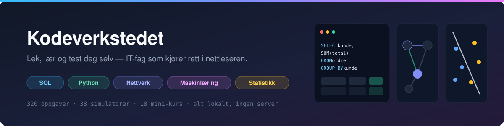

<p align="center">
  
</p>

<p align="center">
  
  
  
  
  
</p>

<p align="center">
  <b>320 oppgaver · 38 simulatorer · 18 mini-kurs</b><br>
  Ingen database, ingen server, ingen konto. Klon, kjør ett skript, lær.
</p>

---

## Hva er dette?

Et øvingsverktøy for IT-fagene i bachelorløpet, laget av en student for å komme
gjennom eksamen. Alt kjører i nettleseren: SQL mot ekte SQLite kompilert til
WebAssembly, Python i Pyodide, og et par titalls interaktive simulatorer som
lar deg dra i parametere og se hva som skjer.

> Ikke offisielt kursmateriale. Ment som forberedelse, ikke som fasit på pensum.

## Tre måter å bruke appen på

|  | Hva det er | Eksempler |
|---|---|---|
| 🎛️ **Lek** | Simulatorer og sandkasser. Dra, klikk, observer. | OSPF med Dijkstra live · beslutningsgrensa til logistisk regresjon · TLS-handshake · log-structured filsystem · k-means som konvergerer |
| 📘 **Lær** | Mini-kurs i lineære løp gjennom ett tema. | Kurose-kapitlene · OSTEP-utvalg · nevrale nett fra grunnen · kryptografi og nettverkssikkerhet |
| 🎯 **Test** | Oppgaver, flashcards, drill og kode-puslespill. | 320 SQL-oppgaver med hint og fasit-diff · Linux-drill · Git-drill · eksamenstrening |

Alt ligger i det samme søkbare biblioteket, farget etter fagområde, med filter
på tema og aktivitetstype.

## Det appen er god på

- **SQL som faktisk kjører.** Spørringene dine går mot en ekte SQLite-database i
  nettleseren. Du får resultattabellen, en diff mot fasit og en forklaring på
  hvorfor fasiten gjør som den gjør — ikke bare «riktig/feil».
- **Simulatorer i stedet for pugging.** Nettverksruting, minnehåndtering,
  gradient descent og hypotesetesting er lettere å forstå når du kan skyve på
  tallene og se kurven bevege seg.
- **Python uten oppsett.** Pyodide gir deg numpy, pandas, scipy og scikit-learn
  i en notebook som kjører lokalt — ingen venv, ingen installasjon.
- **Søk overalt.** `/` eller `⌘K` fra hvilken som helst side: finn tema, oppgave
  eller simulator uten å lete i menyer.
- **Eksamen-modus.** Slår på fasit-forhåndsutfylling i editoren, for fag der
  hjelpemidler er tillatt.

## Kom i gang

```bash
git clone https://github.com/isakdevvv/sql-practice-hub.git
cd sql-practice-hub
./start.sh          # Windows: start.cmd
```

Skriptet installerer [Bun](https://bun.sh) hvis det mangler, henter
avhengigheter, og starter API-serveren (`3001`) og webserveren (`5173`).
Åpne <http://localhost:5173> når terminalen sier fra. Stopp med `Ctrl + C`.

**Oppdateringer** kommer av seg selv: `start.sh` gjør `git pull` før den
starter appen. Hopp over med `SKIP_UPDATE=1 ./start.sh` hvis du er uten nett.

<details>
<summary>Manuell installasjon uten skript</summary>

Krever [Bun](https://bun.sh) ≥ 1.0.

```bash
bun install
bun run dev       # server + web samtidig
bun run dev:web   # bare frontend
```

</details>

## Fagdekning

Innholdet følger emnene i bachelorløpet, med tyngde der eksamen er nærmest:

`SQL og databaser` · `Nettverk (Kurose)` · `Operativsystemer (OSTEP)` ·
`Maskinlæring og nevrale nett` · `Statistikk og sannsynlighet` ·
`Algoritmer og datastrukturer` · `Kryptografi og sikkerhet` ·
`Python` · `Linux og Git` · `Web og API`

## Krav

- [Bun](https://bun.sh) ≥ 1.0 — `start.sh`/`start.cmd` installerer den ved behov på Unix
- Git
- En moderne nettleser (Chromium, Firefox eller Safari)

Ingen database eller serveroppsett. Alt kjører på maskinen din, og ingenting
sendes ut av den.

## Lisens

Se repoet for detaljer.
